# Sum Kinda Magic 🎩🔢

**Sum Kinda Magic** is an impromptu mentalism web app designed for both close-up and stage performances. It presents a grid of shifting numbers and colors, allowing a spectator to make a truly free choice which the performer then "reads" through intuition and psychological cues.

The name reflects the core of the act: it involves a "sum" (addition), and it's *kinda* magic. While it creates a powerful illusion of mind-reading, the method is entirely self-working, allowing you to focus on your performance.

### Key Features:
* **Dual Modes:** Choose between a standard reveal or a "Lie Detector" routine.
* **9 Visual Themes:** From high-tech woodcuts to playful candy colors.
* **Multilingual:** Supports 7 languages with built-in localization.
* **Zero Footprint:** A single-file HTML5 app that requires no installation.

---

### 🎨 Themes

<table border="0">
  <tr>
    <td>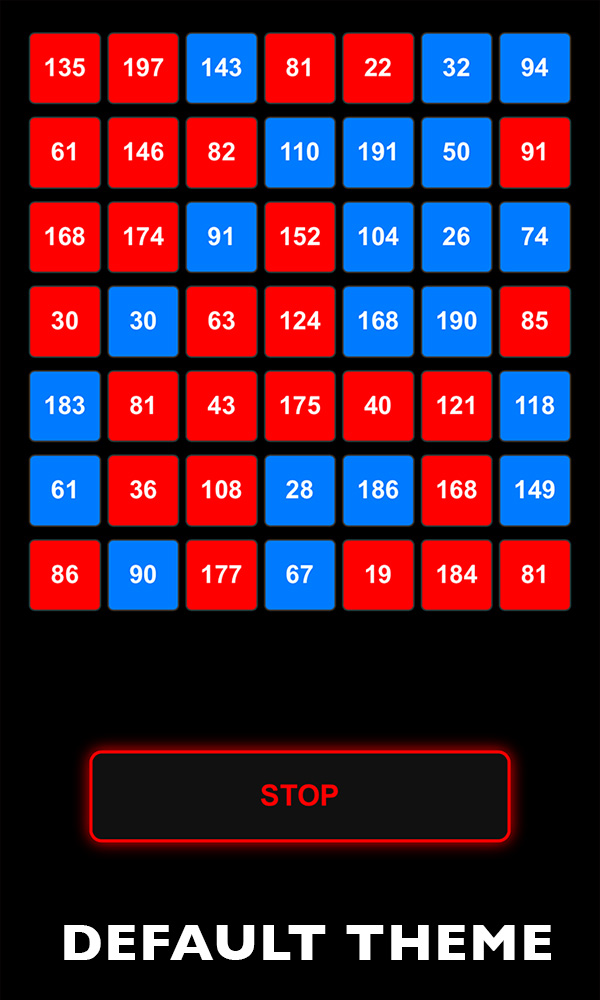</td>
    <td>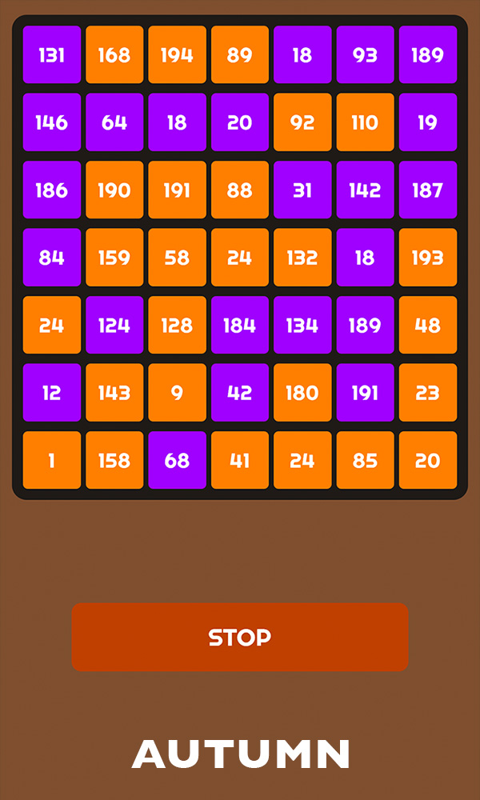</td>
    <td>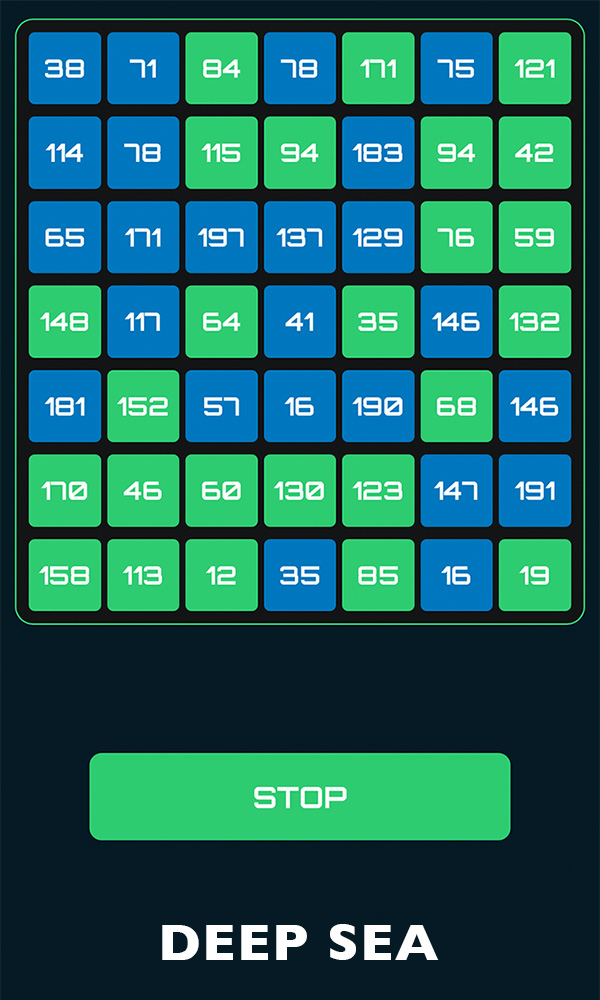</td>
  </tr>
  <tr>
    <td>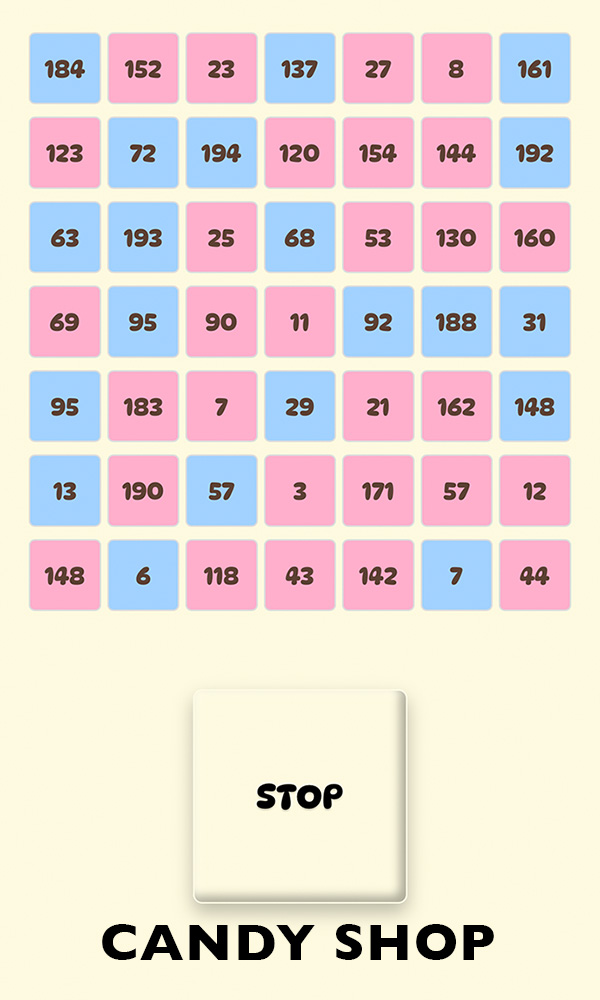</td>
    <td>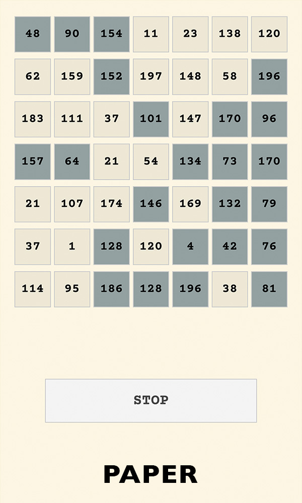</td>
    <td>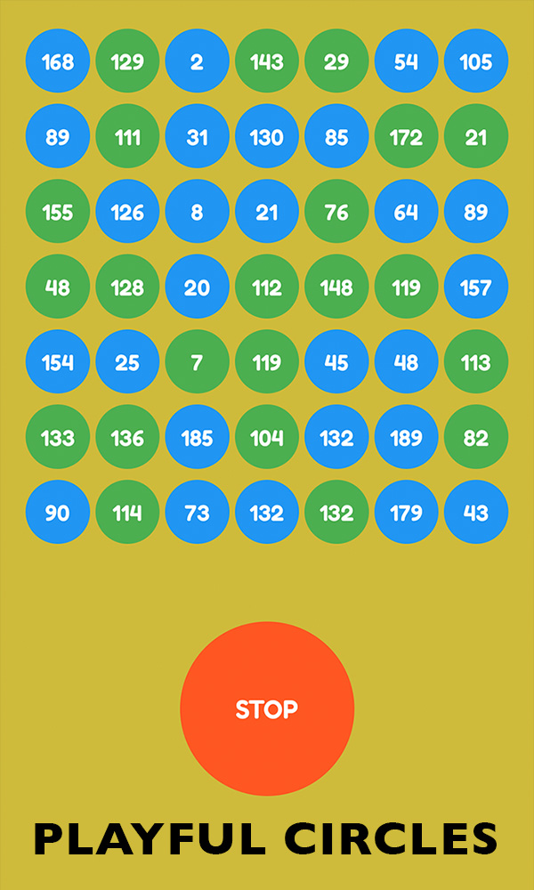</td>
  </tr>
  <tr>
    <td>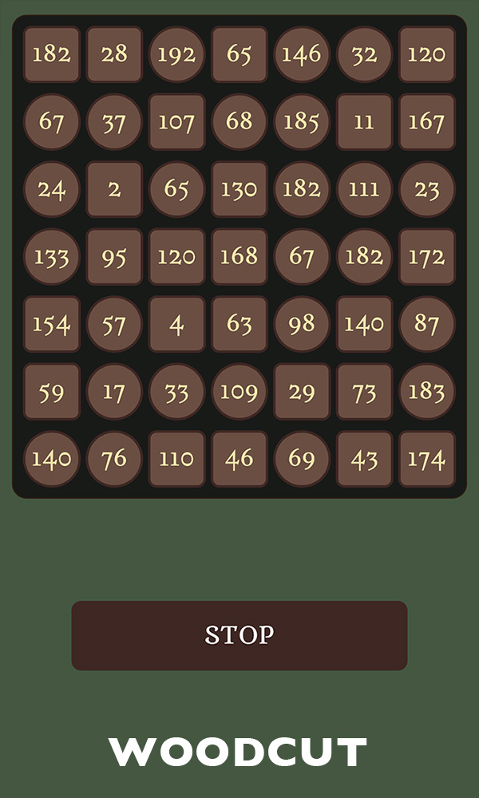</td>
    <td>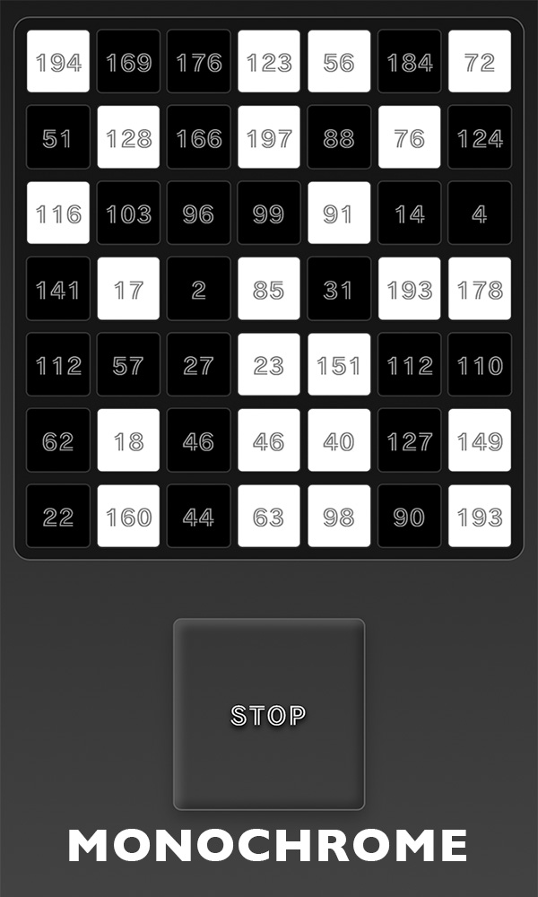</td>
    <td>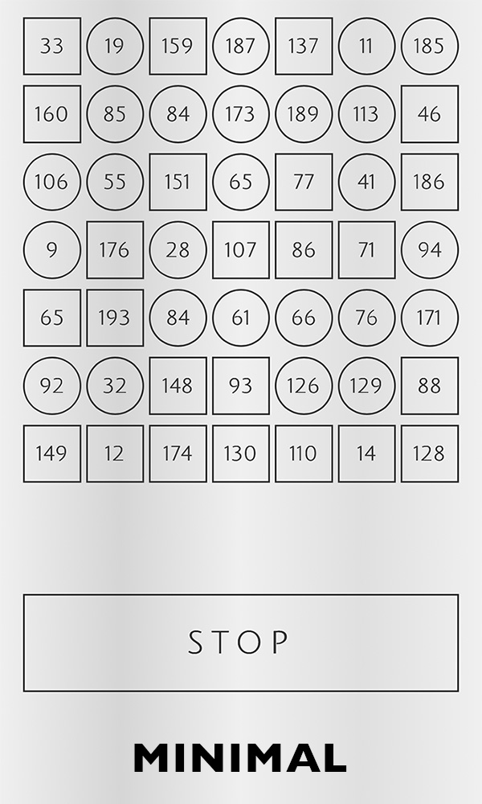</td>
  </tr>
</table>

---

## 🎭 Overview of the Routine

### 1. Preparation
Open the app on your device, or have the spectator scan a QR code to open it on theirs. Once the page is loaded, have the spectator hold the device so you cannot see the screen.

### 2. The Selection
Instruct the spectator to:
1.  Tap **"Start"** to begin the chaotic shuffling of numbers.
2.  Tap **"Stop"** whenever they wish to lock the grid.
3.  If they aren't happy with the numbers shown, they can tap **"Again"**.
4.  Once satisfied, they tap **any single number** they see on the grid.

### 3. The Standard Reveal
Ask the spectator to focus on their chosen number. To "transmit" the value to you, ask them to read the colors (or shapes) of the 7 tiles in their row from left to right. Even without seeing the screen, you can successfully reveal the chosen number.

### 4. The "Lie Detector" Reveal
Instruct the spectator to read the row from left to right, but to **lie** only when they reach the color of their selected number. For example, if the selected tile is Red, they should say "Blue." Ask them not to hesitate or give any indication they are lying; you then "sense" the lie and reveal their number.

---

## 🧠 The Secret: How to Read the Numbers
The secret is simple binary addition. You don't need to be a math genius; the calculation is easily done in your head while the spectator is speaking.

In your mind, split the row of 7 tiles into two groups of three, plus one extra tile at the end.

### The Values
In each group of three, the tiles represent the values **4, 2, and 1**. A tile is counted if it is "Highlighted" (e.g., Red in the default theme, or a Square in the Woodcut theme).

### The Method
1.  **First 3 tiles:** Add the values of only the highlighted tiles. This is your **first digit**.
2.  **Next 3 tiles:** Add the values of only the highlighted tiles. This is your **second digit**.
3.  **Last tile:** If highlighted, the number is in the **100s**. (Place a "1" in front).
4.  **Concatenate:** Put the digits together to find the number.

<table border="0" width="100%">
  <tr>
    <td width="33%">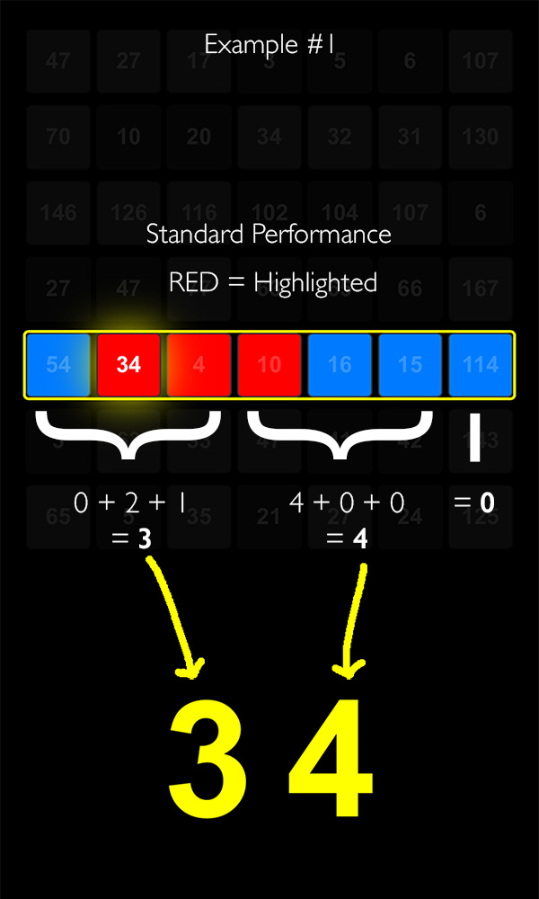</td>
    <td width="33%"></td>
    <td width="33%">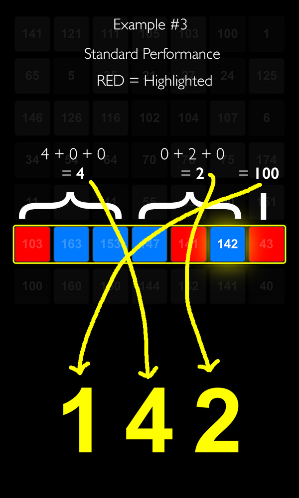</td>
  </tr>
  <tr>
    <td width="33%">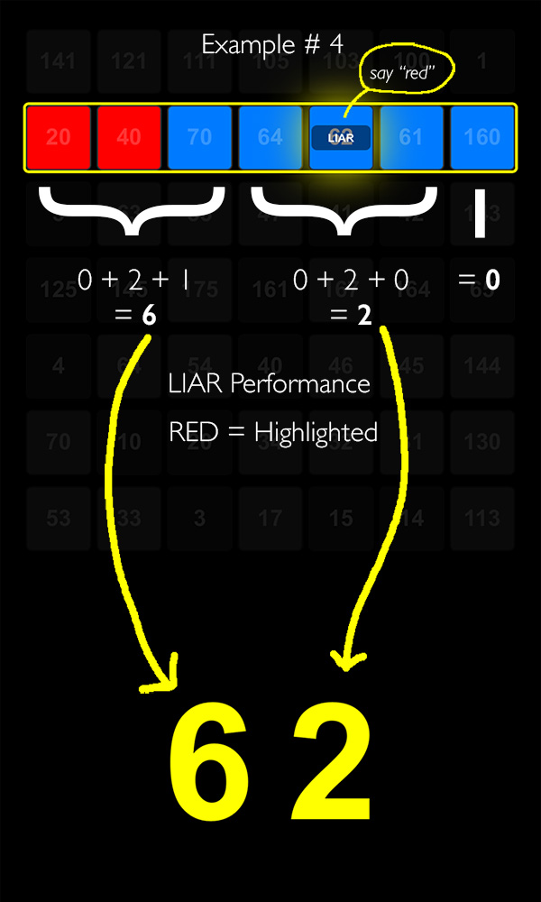</td>
    <td width="33%">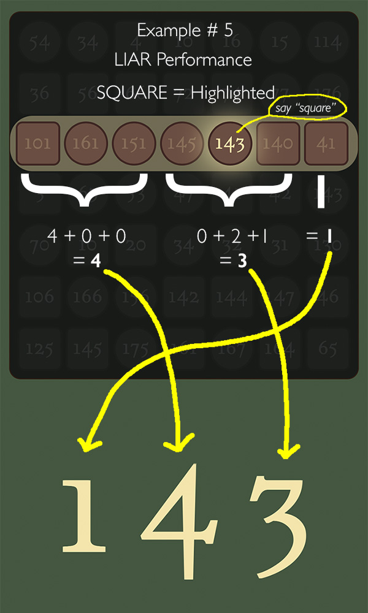</td>
    <td width="33%">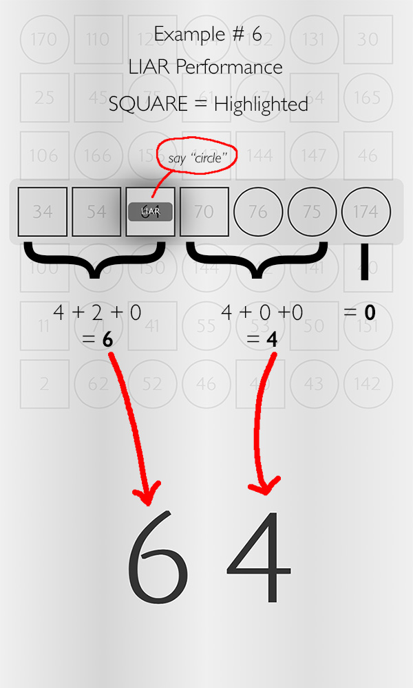</td>
  </tr>
</table>

---

## 🪄 Performance Variations & URL Parameters

Customize your performance by adding parameters to your link. Use `?` for the first parameter and `&` for additional ones.

### 🚀 URL Parameter Reference

| Parameter | Performance Description | Highlight |
| :--- | :--- | :--- |
| `?x=0` | **Standard Mode:** Selected tile flips backgound color on click (Default). |
| `?x=1` | **Liar Mode:** No color flip; flashing **"LIAR"** alert on the selected tile |
| `?x=2` | **Stealth Liar Mode:** No color flip; no visual alert |
| **Themes (t)** | | |
| `?t=0` | **Classic** (Default) | RED |
| `?t=1` | **Autumn** | ORANGE |
| `?t=2` | **High Contrast** | GREEN |
| `?t=3` | **Candy Shop** | PINK |
| `?t=4` | **Paper** | DARK |
| `?t=5` | **Playful Circles** | GREEN |
| `?t=6` | **Woodcut** | SQUARE |
| `?t=7` | **Monochrome** | WHITE |
| `?t=8` | **Minimal** | SQUARE |
| **Languages (l)** | | |
| `?l=en` | **English** (Default) | |
| `?l=es` | **Español** | |
| `?l=fr` | **Français** | |
| `?l=de` | **Deutsch** | |
| `?l=jp` | **日本語** | |
| `?l=tc` | **繁體中文** | |
| `?l=sc` | **简体中文** | |

### 🔗 Example Setup with Combined Parameters
* **Liar Mode (Candy / Spanish):** `https://YOUR-URL.com/?t=3&l=es&x=1`
* **Stealth Liar (Minimal / Japanese):** `https://YOUR-URL.com/?t=8&l=jp&x=2`
* **Standard Performance (Playful Circles / Simplified Chinese):** `https://YOUR-URL.com/?t=5&l=sc`

---

## ℹ️ Additional Information

### 💡 Pro-Tips & Caveats
* **The "Flip" Excuse:** In Standard Mode, the tile changes color/shape. If a spectator asks why, you can make some mystical excuse.
* **Liar Mode Clarity:** Ensure the spectator understands they should only lie about the **color/shape** of their selected tile, not the number itself, and not to lie about any other tile in that row. For the benefit of the performance, a flashing "LIAR" text will appear over the selected tile. If you prefer not to use the "LIAR" text, you can change the URL Parameter (see above).
* **Offline Use:** The default theme relies on system fonts and can be used entirely offline.

### 🛠 Technical Details
* Single-file HTML5 application.
* No external images or dependencies (Google Fonts used for specific themes).
* Distributed under the **GNU AGPL** license.

---
